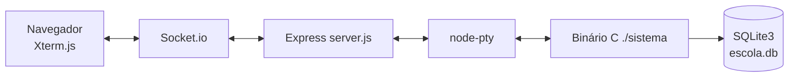

# 🎓 Sistema de Gerenciamento de Colégio

Sistema full-stack para gerenciamento escolar, desenvolvido em **C** com persistência em **SQLite3** e interface via **terminal web** (navegador). A aplicação executa a lógica de negócio em um binário C rodando dentro de um container Docker, e expõe esse terminal ao usuário através de um servidor Node.js com Xterm.js.

<p align="center">
  
  
  
  
  
 
</p>

> Projeto educacional desenvolvido para a disciplina de **Residência Tecnológica**, com o objetivo de implementar um sistema de gerenciamento escolar em C, com persistência em SQLite3 e interface em terminal.

## Índice

- [Visão geral](#visão-geral)
- [Funcionalidades](#funcionalidades)
- [Arquitetura](#arquitetura)
- [Demonstração](#demonstração)
- [Requisitos](#requisitos)
- [Instalação](#instalação)
- [Execução](#execução)
- [Módulos e rotinas](#módulos-e-rotinas)
- [Tecnologias](#tecnologias)
- [Robustez e validações](#robustez-e-validações)
- [Persistência e dados](#persistência-e-dados)
- [Estrutura](#estrutura)
- [Equipe e licença](#equipe-e-licença)

## Visão geral

O **Sistema de Gerenciamento de Colégio** permite cadastrar, consultar, atualizar e remover professores, alunos e turmas, além de executar rotinas acadêmicas como matrícula, lançamento de notas, controle de faltas e emissão de boletim. A aplicação utiliza uma arquitetura simples em camadas:

- **CLI (main/menu)**: loop principal e menus por módulo (professores/turmas/alunos).
- **Módulos de domínio**: `alunos.c`, `professores.c`, `turmas.c`, `matriculas.c` implementam o CRUD e as regras de negócio.
- **Database**: `database.c` cuida da abertura, inicialização e migrações do SQLite3.
- **Input**: `input.c` centraliza a sanitização de entrada do usuário.
- **Frontend**: `server.js` faz a ponte entre o binário C (via PTY) e o terminal exibido no navegador com Xterm.js.

Os dados são armazenados em `database/escola.db`, um arquivo SQLite3 persistido em volume, portanto **não são apagados** quando o container é reiniciado.

## Funcionalidades

O sistema é um **CRUD completo (Create / Read / Update / Delete)** para os módulos principais:

| Módulo             | Create | Read | Update | Delete | Extras                                                                                |
| ------------------- | :----: | :--: | :----: | :----: | -------------------------------------------------------------------------------------- |
| 👨‍🏫 Professores | ✅     | ✅   | ✅     | ✅     | Busca por CPF/nome; valida vínculo com turmas antes de excluir                        |
| 📚 Alunos           | ✅     | ✅   | ✅     | ✅     | Busca por CPF/nome; listar por turma; remoção limpa matrículas                        |
| 🏫 Turmas           | ✅     | ✅   | ✅     | ✅     | Listar alunos da turma; listar turmas por professor; bloqueia remoção com matrículas   |

Também estão disponíveis rotinas acadêmicas:

- 📝 Matrícula de aluno em turma
- 📊 Lançamento de notas
- 📅 Controle de faltas
- 📋 Boletim com notas e faltas por disciplina

## Arquitetura



## Demonstração

O acesso é feito inteiramente via navegador, sem necessidade de terminal local.

```
🌍 Acesse em: http://localhost:8080
```

Exemplo de fluxo típico no menu principal exibido pelo terminal web:

```
=== Sistema de Gerenciamento de Colégio ===
1. Professores
2. Alunos
3. Turmas
4. Matrícula / Notas / Faltas
5. Boletim
0. Sair
> 2

--- Módulo Alunos ---
1. Cadastrar aluno
2. Listar alunos
3. Buscar por CPF/nome
4. Atualizar aluno
5. Remover aluno
> 1

CPF: 12345678901
Nome: João da Silva
✅ Aluno cadastrado com sucesso!
```

Listagens ou buscas sem resultado retornam a mensagem amigável **"Nenhum registro encontrado."**, e operações de Update/Delete sempre solicitam confirmação antes de persistir no banco.

## Requisitos

- Docker e Docker Compose (uso recomendado)
- Alternativamente, para compilação manual:
  - GCC
  - `libsqlite3-dev` (Linux, para compilar manualmente)

Confira as versões instaladas:

```bash
docker --version
docker compose version
gcc --version
```

## Instalação

Clone o repositório e entre na pasta do projeto:

```bash
git clone <url-do-repositorio>
cd teste-escola
```

## Execução

### 🐳 Para uso (Docker)

```bash
chmod +x entrypoint.sh
docker compose up
```

O `CMD` do `dockerfile` automatiza o ciclo completo a cada start do container:

1. `make clean` → limpa binários/objetos
2. `make` → compila o código C (gerando `obj/*.o` e o executável `./sistema`)
3. inicia o servidor web em `frontend/server.js` → expõe o terminal via navegador

Isso garante que alterações no código C sejam refletidas no próximo start (ideal para desenvolvimento).

A aplicação ficará disponível em `http://localhost:8080`.

### 🧱 Compilação manual

Linux/macOS:

```bash
mkdir -p database && gcc -Wall -Wextra -g -Iinclude src/*.c -o sistema -lsqlite3 && ./sistema
```

Windows:

```bash
mkdir -p database && gcc -Wall -Wextra -g -Iinclude src\*.c -o sistema -lsqlite3 && .\sistema
```

### 🛠️ Para desenvolvimento (Docker + Makefile)

```bash
chmod +x entrypoint.sh
docker compose up -d
docker exec -it sistema_escola bash
```

Dentro do container:

```bash
make          # compila (obj/*.o + binário)
./sistema     # executa o sistema
make clean    # remove obj/ e executável
make cleanall # limpa o banco de dados
```

📌 Observações:

- Rode `make clean` antes de subir o projeto, pois cada máquina recompila localmente.
- Para usar comandos bash fora do container (Linux): `sudo chown -R $USER:$USER . && chmod -R 775 database/`
- Caso o código não rode corretamente: `docker compose down && docker compose up -d --build`
- Para acompanhar a execução do container: `docker logs -f sistema_escola`

## Módulos e rotinas

| Rotina         | Descrição                                                        |
| -------------- | ------------------------------------------------------------------ |
| Matrícula      | Vincula um aluno (CPF) a uma turma (código)                       |
| Notas          | Lança a nota do aluno na matrícula correspondente                 |
| Faltas         | Registra o controle de faltas na matrícula correspondente          |
| Boletim        | Consolida notas e faltas por disciplina/turma para um aluno        |

## Tecnologias

- **C (GCC)**: lógica do sistema e interface de terminal (CLI).
- **SQLite3**: persistência local em arquivo (`escola.db`).
- **Docker + Docker Compose**: ambiente reprodutível e conteinerizado.
- **Node.js (Express + Socket.io)**: servidor web que expõe o terminal.
- **node-pty**: executa o binário C como um PTY real dentro do container.
- **Xterm.js**: interface de terminal moderna renderizada no navegador.
- **Makefile**: automação de build (gera `.o` em `obj/`).

## Robustez e validações

- 🧹 **Sanitização de input**: leituras centralizadas em `read_int`, `read_line` e `read_token` (baseadas em `fgets` + validação), evitando loops infinitos quando o usuário digita letras onde se espera números.
- 🧾 **Tratamento de erros do SQLite3**: todas as operações relevantes verificam o retorno (`rc != SQLITE_OK`) e exibem a mensagem específica via `sqlite3_errmsg`.
- 🔐 **Regras de negócio**: CPF como chave primária, integridade referencial (Foreign Keys) ativa via `PRAGMA`, e sem restrição UNIQUE em matérias, permitindo múltiplos docentes na mesma disciplina.
- 🧠 **Feedback ao usuário**: mensagens claras de sucesso em Create/Update/Delete, e mensagem amigável para listagens vazias.
- ⚠️ **Confirmação obrigatória**: operações destrutivas (Update/Delete) pedem confirmação antes de persistir no banco.

## Persistência e dados

O sistema usa o arquivo `database/escola.db` como persistência local.

- 📦 **Código e banco persistem**: o bind mount `.:/app` garante que `database/` (incluindo `escola.db`) permaneça no host e sobreviva a reinícios do container.
- `./database:/app/database`: mantém o arquivo `escola.db` salvo na pasta local, permitindo backups.
- 🧩 **Dependências do Node isoladas**: o volume anônimo `/app/frontend/node_modules` mantém os módulos instalados dentro do container, evitando conflitos com o host.

### Relações principais

- 📚 **Alunos** (`alunos`) identificados por `cpf` (PK/UNIQUE).
- 👨‍🏫 **Professores** (`professores`) identificados por `cpf` (PK/UNIQUE).
- 🏫 **Turmas** (`turmas`) identificadas por `codigo` (PK/UNIQUE), com `cpf_professor` (FK → `professores.cpf`).
- 📝 **Matrículas** (`matriculas`) fazem a ponte N:N entre alunos e turmas, via `cpf_aluno` (FK) e `codigo_turma` (FK); **nota** e **faltas** ficam armazenadas na própria matrícula.

```text
id  cpf_aluno     codigo_turma   nota   faltas
1   12345678901   T001           8.5    2
2   12345678901   T002           7.0    1
```

⚠️ O SQLite3 é um banco de arquivo local voltado para uso educacional; não há autenticação ou controle de acesso configurado para ambiente de produção.

## Estrutura

```text
📂 teste-escola
│
├─ 📂 src/               → implementação (.c)
│  ├─ main.c             → loop/menu principal
│  ├─ menu.c             → menus por módulo (professores/turmas/alunos)
│  ├─ database.c         → abertura/init/migrações do banco (SQLite3)
│  ├─ alunos.c           → CRUD de alunos + filtros
│  ├─ professores.c      → CRUD de professores + buscas
│  ├─ turmas.c           → CRUD de turmas + filtros/listagens
│  ├─ matriculas.c       → matrícula, notas, faltas e boletim
│  ├─ callbacks.c        → callbacks de impressão (listas)
│  ├─ input.c            → sanitização de input (read_int/read_line/...)
│  └─ sqlite_utils.c     → helpers SQLite (erros, listas vazias, etc.)
│
├─ 📂 frontend/           → servidor web do terminal (ponte PTY ↔ navegador)
│  ├─ server.js           → Express + Socket.io + node-pty (spawn do executável C)
│  └─ index.html          → UI web + Xterm.js (terminal no browser)
│
├─ 📂 include/            → cabeçalhos (.h)
│  ├─ imports.h           → centralizador de includes do projeto
│  ├─ alunos.h
│  ├─ professores.h
│  ├─ turmas.h
│  ├─ matriculas.h
│  ├─ visual.h
│  ├─ database.h
│  ├─ menu.h
│  ├─ input.h
│  └─ sqlite_utils.h
│
├─ 📂 obj/                → arquivos objeto (.o) gerados pelo Makefile
├─ 📂 database/           → persistência local do banco
│  └─ escola.db           → tabelas do sistema
│
├─ makefile               → build via Makefile (gera .o em obj/)
├─ dockerfile             → build do container
└─ docker-compose.yml     → execução via Docker Compose
```

## Equipe e licença

**Equipe:**

- Valdir
- Henrique
- Celina
- Arthur

Não existe um arquivo de licença neste repositório no momento. O código deve ser considerado **sem licença explícita** até que a equipe adicione uma licença formal, como MIT ou Apache 2.0.

---

Projeto desenvolvido para fins educacionais, para a disciplina de Residência Tecnológica. Código organizado por módulos para facilitar manutenção.
